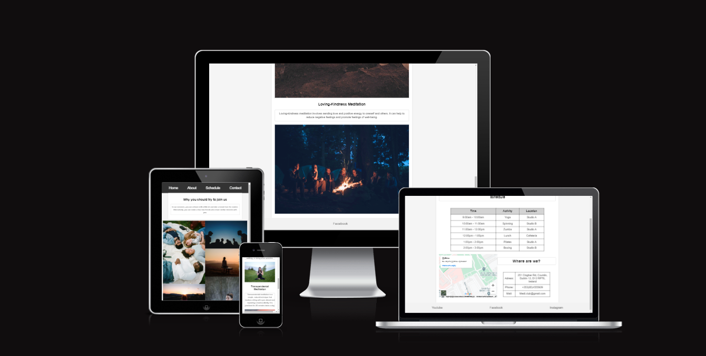
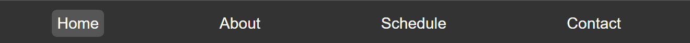
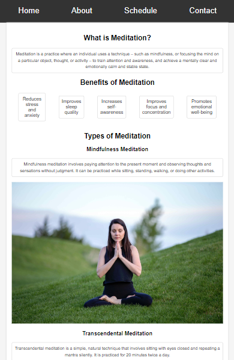
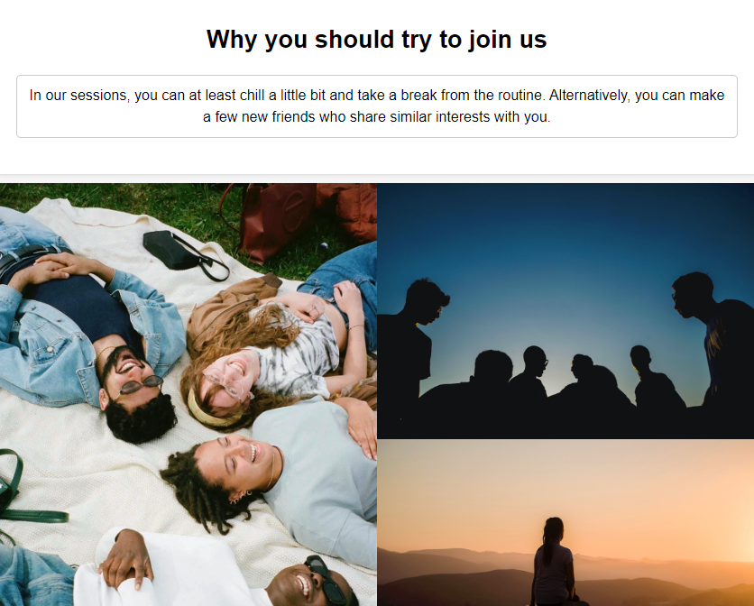
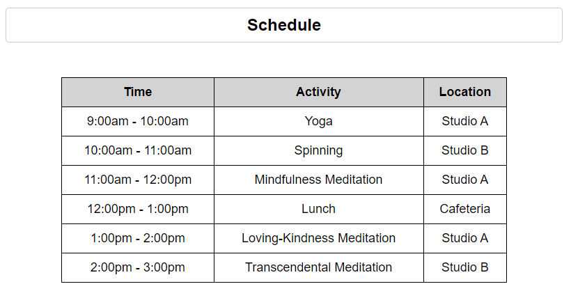
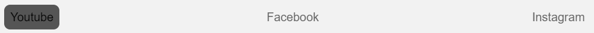
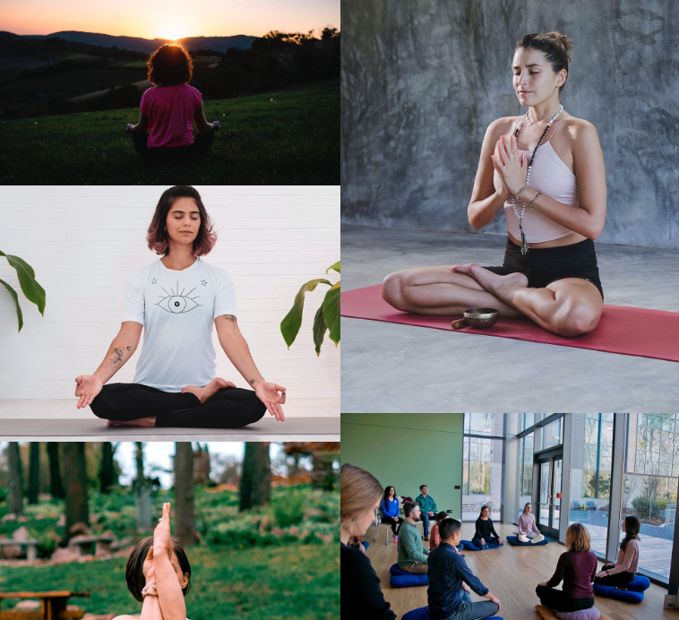
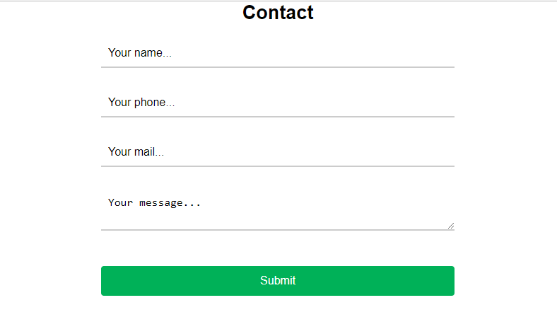

# Medi-Club

On the Medi-Club website, you can learn about the benefits of a meditation session, view a gallery of photos from our sessions, contact us to try it out, and explore our links.

## Features 

In this section, you should go over the different parts of your project, and describe each in a sentence or so. You will need to explain what value each of the features provides for the user, focusing on who this website is for, what it is that they want to achieve and how your project is the best way to help them achieve these things.

### Existing Features

- __Navigation Bar__

  - Featured on all 4 pages, the full responsive navigation bar includes Home page, About, Schedule and Contact page and is identical in each page to allow for easy navigation.
  - This section will allow the user to easily navigate from page to page across all devices.

- __The Main Page__

  - The main page includes a introductory information.

  - This section introduces the user main information and benefits of a meditation.

- __About Section__

  - The 'About' section will allow the user to see the benefits of joining the Medi-Club sessions, by see satisfied customers. 
  - This user will see the value of signing up for the Medi-Club session. This should encourage the user to fill 'Contact' form. 

- __Session Times section__

  - This section will allow the user to see exactly when the meetups will happen, where they will be located. 
  - This section will be updated as these times change to keep the user up to date. 

- __The Footer__ 

  - The footer section includes links to the relevant social media sites for Medi_Club. The links will open to a new tab to allow easy navigation for the user. 
  - The footer is valuable to the user as it encourages them to keep connected via social media

- __About Section__

  - The gallery will provide the user with supporting images to see what the meet ups look like. 
  - This section is valuable to the user as they will be able to easily identify the types of events the organisation puts together. 

- __The 'Contact' Page__

  - This page will allow the user to get signed up to Medi-Club to start their meditation journey with the community. The user will be able specify if they would like to take part in our club. The user will be asked to submit their name, phone, email address and message. 

# Testing 

The site works correctly. I tested it on different browsers and screen resolutions.

## Validator Testing 

- HTML
  - 13 errors were returned when passing through the official.All errors :  Duplicate ID,but with out duplicate site not works how he must works. [W3C validator](https://validator.w3.org/nu/?doc=https%3A%2F%2Freadytow0rk.github.io%2Fpp1-%2Findex.html)
- CSS
  - No errors were found when passing through the official [(Jigsaw) validator](https://jigsaw.w3.org/css-validator/validator?uri=https%3A%2F%2Freadytow0rk.github.io%2Fpp1-%2Findex.html&profile=css3svg&usermedium=all&warning=1&vextwarning=&lang=en)

## Deployment

This section should describe the process you went through to deploy the project to a hosting platform (e.g. GitHub) 

- The site was deployed to GitHub pages. The steps to deploy are as follows: 
  - In the GitHub repository, navigate to the Settings tab 
  - From the source section drop-down menu, select the Main Branch
  - Once the main branch has been selected, the page will be automatically refreshed with a detailed ribbon display to indicate the successful deployment. 

The live link can be found here - https://readytow0rk.github.io/pp1-/about.html

### Content 

- The text for the Home page was taken from Wikipedia.
- All photos i took on https://unsplash.com/
- The favicon i took on google images and after convert png to ico

